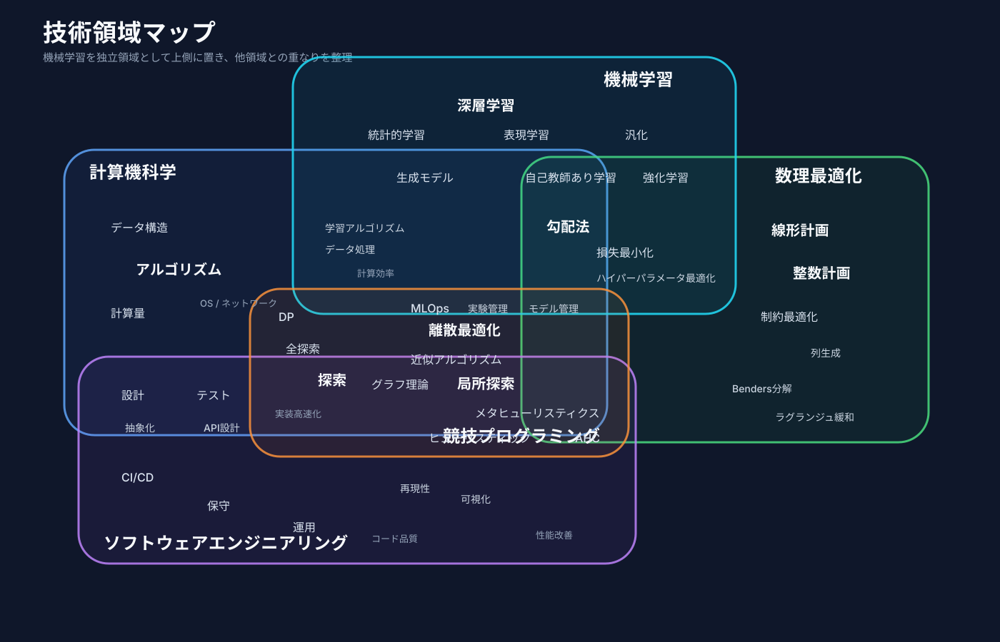

# 競技プログラミングとは

## 具体的な問題1：Ants

棒の上のアリが全員落ちる最短・最長時間を求める。

## 具体的な問題2：インタラクティブな最適化デモ

- 障害物のあるグリッドに、2×1の駐車枠を敷き詰める
- クリックして障害物を配置する
- その場で計算し、最適な駐車枠を表示する
- 「障害物クリア」「最適化計算」ボタンを配置する
- 市松模様で2領域に分け、二部マッチングのアルゴリズムで解く

## 具体的な問題3：厳密最適が出せない問題（Container Loading）

多数の荷物を、回転制約や積載順、支持面積などの条件を守りながらコンテナに積み込む。高さや積み順も評価されるため、厳密な最適解を求めるのは困難。

## 技術マップ

